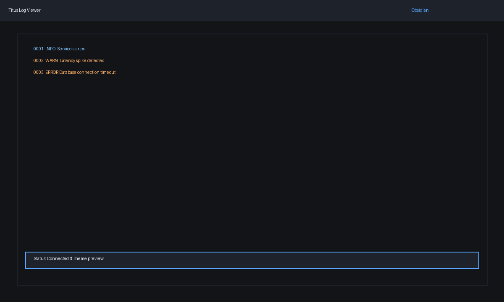
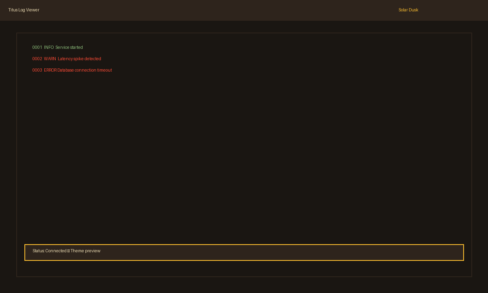
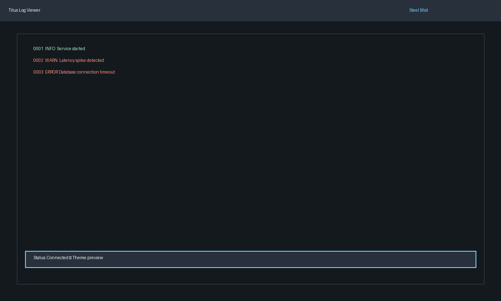
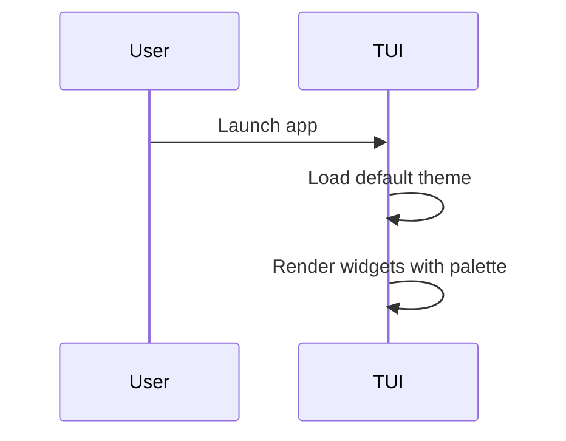

# Application color scheme plan

## Goal
Deliver a cohesive default color scheme for Titus that is readable, calm, and accessible across light/dark terminals.

## Constraints & considerations
- Must align with Ratatui color support.
- Should keep enough contrast for log levels.
- Should be compatible with future theme switching.

## User stories
- As a user, I want the default colors to be easy on the eyes.
- As a user, I can distinguish log levels at a glance.

## Solution options
### Option A: Obsidian (dark neutral)


**Pros**
- Familiar dark IDE look, high contrast.

**Cons**
- Dark background may be too heavy for some users.

### Option B: Solar Dusk (warm palette)


**Pros**
- Warm accent colors; good for long sessions.

**Cons**
- Warning/error colors may blend with accent.

### Option C: Steel Mist (cool palette)


**Pros**
- Cool, calm palette; strong separation between levels.

**Cons**
- Could appear too muted on some terminals.

## Implementation plan (shared steps)
1. **Define palette struct**
   - `ThemePalette { background, panel, accent, info, warn, error, text }`.
2. **Apply in UI**
   - Replace hardcoded colors with palette references.
3. **Accessibility check**
   - Ensure contrast ratio (>= 4.5 for text).

## Option A implementation plan
```rust
const OBSIDIAN: ThemePalette = ThemePalette {
    background: Color::Rgb(18, 20, 24),
    panel: Color::Rgb(30, 34, 42),
    accent: Color::Rgb(88, 166, 255),
    info: Color::Rgb(130, 200, 255),
    warn: Color::Rgb(255, 178, 102),
    error: Color::Rgb(255, 99, 109),
    text: Color::Rgb(230, 233, 240),
};
```

## Option B implementation plan
```rust
const SOLAR_DUSK: ThemePalette = ThemePalette {
    background: Color::Rgb(26, 22, 18),
    panel: Color::Rgb(46, 36, 28),
    accent: Color::Rgb(250, 189, 47),
    info: Color::Rgb(142, 192, 124),
    warn: Color::Rgb(251, 73, 52),
    error: Color::Rgb(204, 36, 29),
    text: Color::Rgb(235, 219, 178),
};
```

## Option C implementation plan
```rust
const STEEL_MIST: ThemePalette = ThemePalette {
    background: Color::Rgb(20, 25, 30),
    panel: Color::Rgb(40, 48, 60),
    accent: Color::Rgb(120, 210, 255),
    info: Color::Rgb(170, 230, 200),
    warn: Color::Rgb(255, 145, 120),
    error: Color::Rgb(255, 100, 100),
    text: Color::Rgb(235, 240, 245),
};
```

## Integration with other features
- **Theme support**: each scheme can be a selectable theme.
- **Search highlighting**: define a `highlight` color that stays readable.

## Risks & mitigation
- Colors may look different on various terminals → test on popular terminal profiles.

## Open questions
- Should the default be dark-only or detect terminal background?

## Sequence diagram (theme application)

