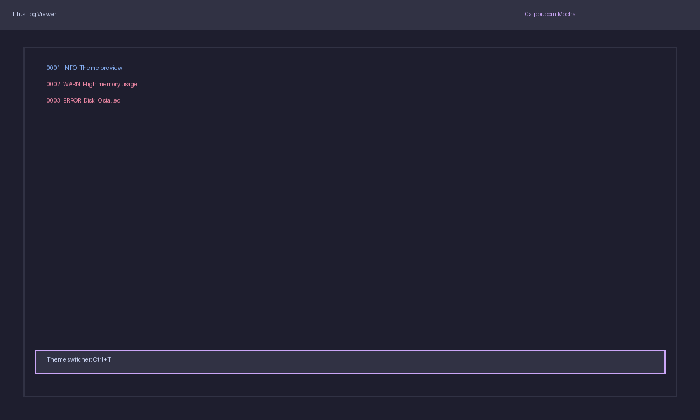
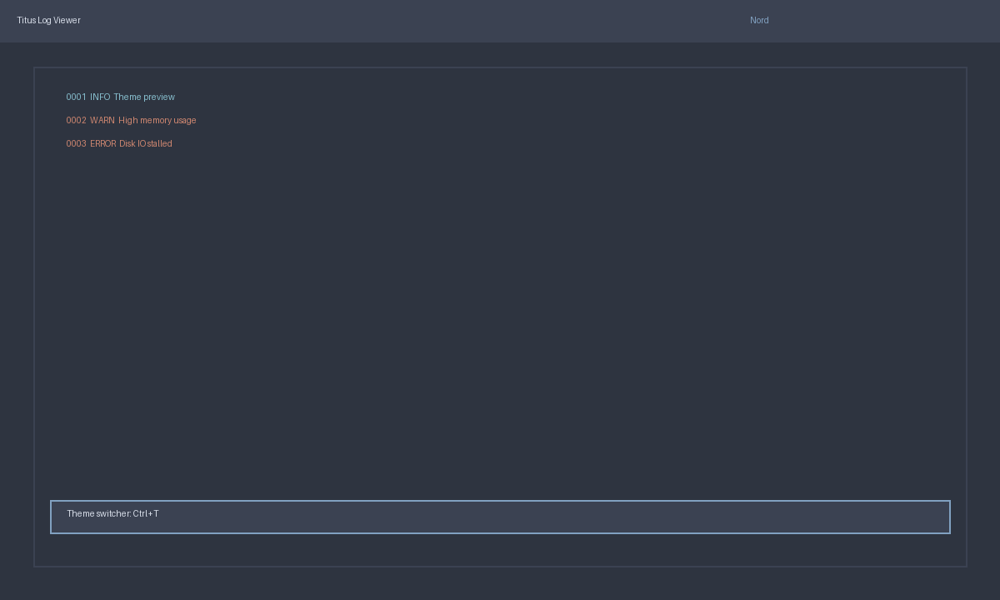
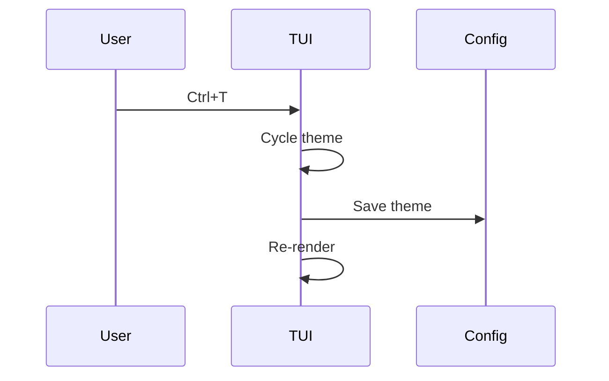

# Application color theme support plan

## Goal
Allow users to switch between multiple predefined color themes without restarting the app.

## Constraints & considerations
- Must not break existing color references.
- Should allow easy addition of new themes.

## User stories
- As a user, I can switch between themes (e.g., Catppuccin, Nord) during runtime.
- As a user, theme changes persist across sessions.

## Solution options
### Option A: Theme registry with hotkeys


**Pros**
- Simple to implement; uses keyboard shortcuts.

**Cons**
- Limited discoverability unless documented.

### Option B: Theme picker modal


**Pros**
- User-friendly selection dialog.

**Cons**
- Requires additional UI flow.

## Implementation plan (shared steps)
1. **Theme model**
   - Define `Theme { name, palette }`.
   - Store in `Vec<Theme>` and a `current_theme` index.
2. **State**
   - Add `ThemeState` to `State` with `current_theme` + optional modal state.
3. **Persistence**
   - Save selected theme in config file (e.g., `config/theme.toml`).
4. **Rendering**
   - Update UI to read colors from active theme palette.

## Option A implementation plan (hotkeys)
```rust
fn handle_theme_shortcut(state: &mut State) {
    state.theme.current = (state.theme.current + 1) % state.theme.themes.len();
}
```

- Bind `Ctrl+T` to cycle theme.

## Option B implementation plan (modal picker)
```rust
fn render_theme_picker(frame: &mut Frame, area: Rect, state: &State) {
    let modal = centered_rect(40, 40, area);
    frame.render_widget(Block::default().title("Themes"), modal);
}
```

- Use list widget to select theme, Enter to apply.

## Integration with other features
- **Color scheme**: theme palettes come from scheme plan.
- **Search highlighting**: ensure highlight color is defined per theme.

## Risks & mitigation
- Theme changes could cause low contrast → validate contrast for each palette.

## Open questions
- Should user-defined themes be supported in v1?

## Sequence diagram (theme switch)

