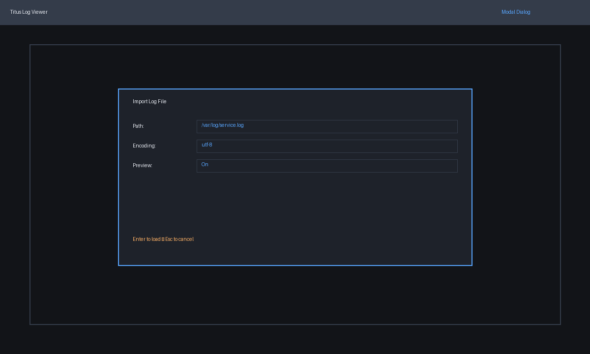
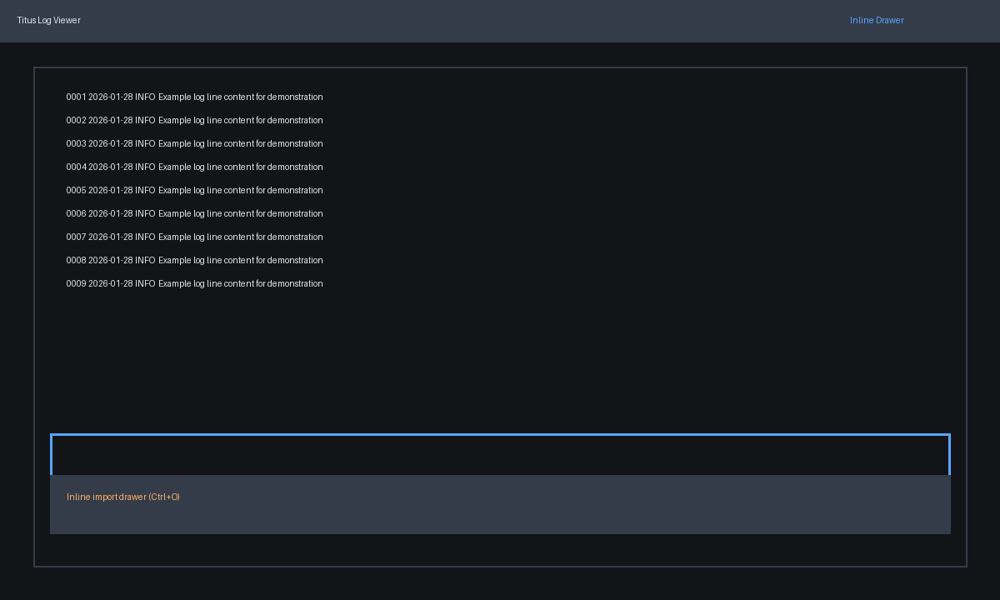
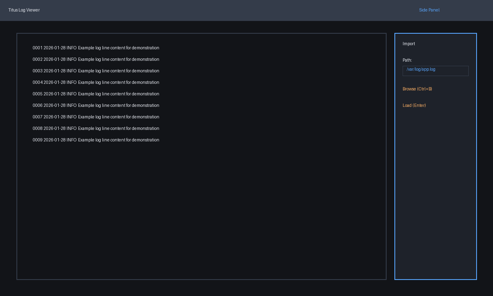
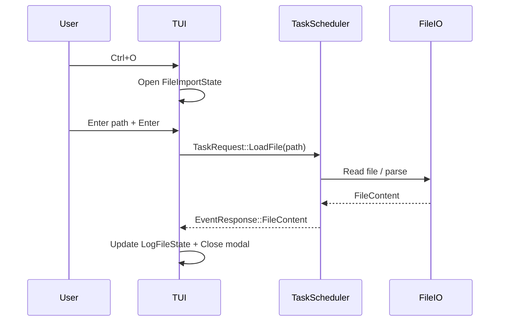

# File import feature plan

## Goal
Provide a keyboard-driven import flow to open additional log files after the app starts, with clear validation feedback and compatibility with partial file loading, search, and multi-file management.

## Constraints & considerations
- Must integrate with `tui/file_io` pipeline and avoid blocking the UI thread.
- Needs to coordinate with partial log loading window and search features so imported files share the same data model.
- Must not break CLI-based `--file` argument import that exists today.

## User stories
- As a user, I can press a shortcut to open an import dialog and load a log file without restarting the app.
- As a user, I receive immediate feedback if the path is invalid, unreadable, or unsupported.
- As a user, I can cancel the flow without affecting the currently opened log file.

## Solution options
### Option A: Modal import dialog (central)
**Concept**: Use a centered modal that captures input focus and returns to the log viewer on success or cancel.



**Pros**
- Clear focus, blocks conflicting commands.
- Easy to show validation and preview metadata.

**Cons**
- Interrupts workflow more than a non-modal drawer.

### Option B: Inline bottom drawer
**Concept**: A drawer at the bottom of the screen with a one-line path input and status messages.



**Pros**
- Keeps log context visible.
- Minimal layout changes.

**Cons**
- Less space for metadata or errors.

### Option C: Side panel
**Concept**: A right-side panel for file path entry, history, and validation.



**Pros**
- Persistent panel could align with multi-file support.

**Cons**
- Uses horizontal space; reduces visible log width.

## Recommended decision points
- Decide if file import should be modal or integrated with the multi-file UI (if planned soon).
- Decide how to handle batch importing vs single file.
- Confirm default encoding detection (UTF-8 fallback vs explicit selection).

## Implementation plan (shared steps)
1. **State extensions**
   - Add a `Mode::FileImport` state and `FileImportState` struct for input buffer, validation errors, and import status.
   - Track recent file paths for quick reuse (optional, used by Option C).
2. **Events & tasks**
   - Introduce a `TaskRequest::LoadFile(PathBuf)` to offload file I/O.
   - On completion, update `State` with new `LogFileState` and set active file pointer.
3. **Validation**
   - Validate existence, read permission, and size limits.
   - Emit error messages into `FileImportState` so UI can render them.
4. **Integration points**
   - Ensure imported files use the same `LogFileState` model required by partial loading.
   - Wire search view to active file selection.
5. **Telemetry**
   - Log import successes/failures with `log` macros for debugging.

## Option A implementation plan (modal)
```rust
// pseudo-structs for state
struct FileImportState {
    input: String,
    error: Option<String>,
    is_loading: bool,
}

fn handle_file_import_event(event: KeyEvent, state: &mut State) {
    if event.code == KeyCode::Enter {
        state.task_scheduler.queue(TaskRequest::LoadFile(state.file_import.input.clone()));
    }
}
```

- Render modal using `ratatui::widgets::Block` and `Clear` to overlay.
- Bind `Ctrl+O` to open modal, `Esc` to cancel.
- After load, close modal and update active file.

## Option B implementation plan (inline drawer)
```rust
fn render_import_drawer(frame: &mut Frame, area: Rect, state: &State) {
    let drawer_area = Rect { y: area.height - 3, height: 3, ..area };
    frame.render_widget(Block::default().title("Import"), drawer_area);
}
```

- Layout log area minus 3 rows when drawer active.
- Keep non-modal input; block conflicting shortcuts when drawer active.

## Option C implementation plan (side panel)
```rust
fn layout(frame: &mut Frame, area: Rect, importing: bool) -> (Rect, Rect) {
    if importing {
        Layout::horizontal([Constraint::Min(60), Constraint::Length(30)]).split(area)
    } else {
        Layout::horizontal([Constraint::Min(1)]).split(area)
    }
}
```

- Persistent `Import` panel that can double as `Files` list later.
- Provide browse-like shortcuts to open a path picker (if implemented).

## Integration with other features
- **Search/Find**: ensure new file data is indexed for search.
- **Partial loading**: use same windowed loading API for imported files.
- **Multiple files**: import flow should append to the file list rather than replacing.

## Risks & mitigation
- Large files may block UI if loaded on main thread → enforce async loading with task scheduler.
- Invalid paths may crash if not handled → treat validation errors as UI messages.

## Open questions
- Should the import dialog support file history and quick select?
- Should the import dialog allow multiple file selection in one step?
- Should the dialog allow selecting a specific encoding?

## Suggested milestones
- **Milestone 1**: Add `FileImportState`, keyboard shortcuts, and basic validation.
- **Milestone 2**: Add async loading task + UI status messaging.
- **Milestone 3**: Integrate with multi-file list and search indexing.

## Sequence diagram (modal import flow)

