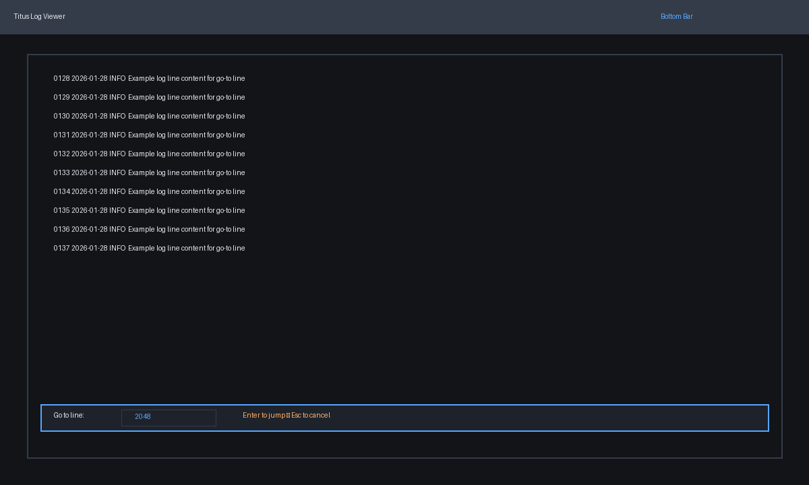
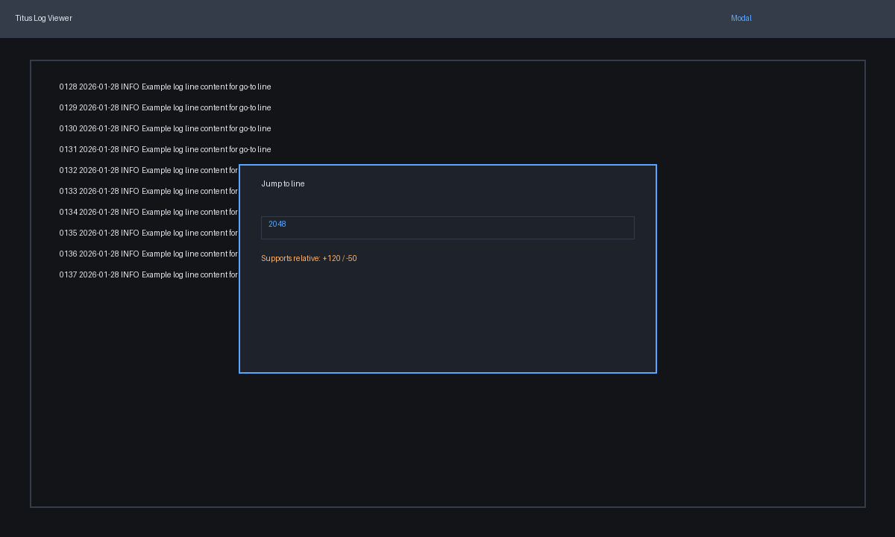
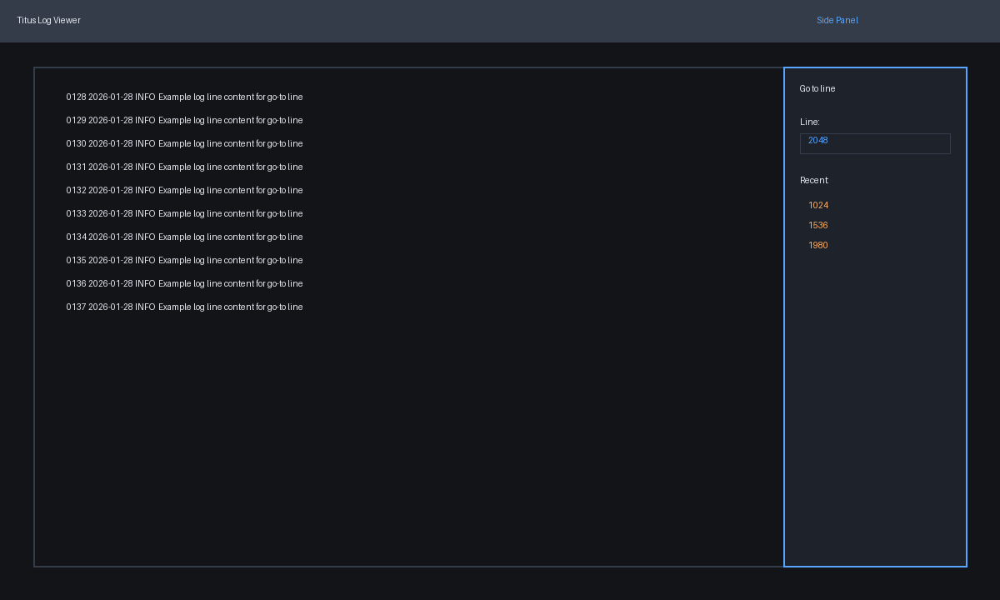
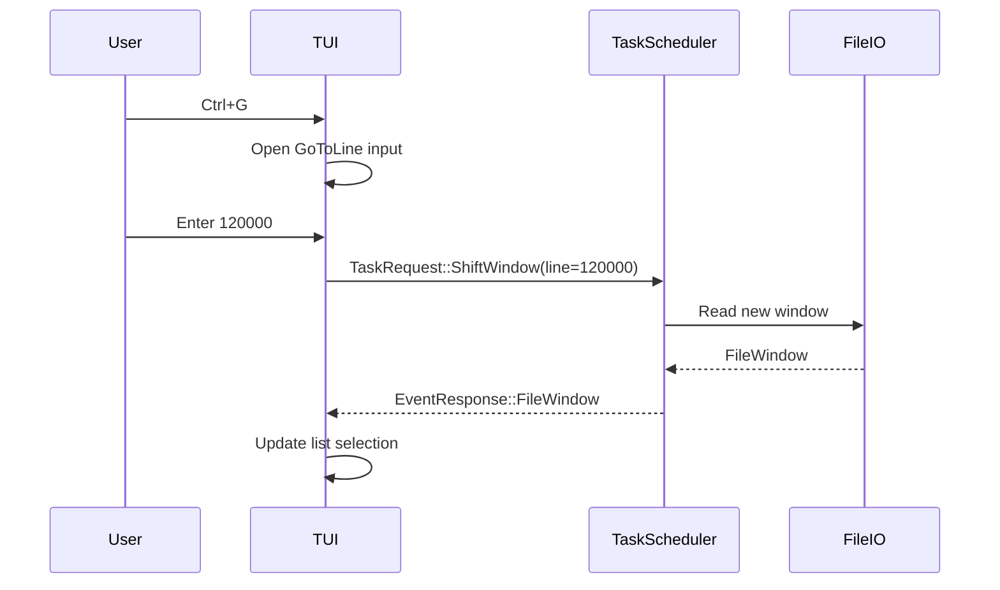

# Go-to line feature plan

## Goal
Provide a fast way to jump to a specific line number in the active log file while keeping state consistent with partial file loading and search highlighting.

## Constraints & considerations
- Must work whether the file is fully loaded or windowed.
- Needs to cooperate with search highlighting and selection state.
- Should support large line numbers without blocking the UI.

## User stories
- As a user, I can jump to a line by number using a shortcut.
- As a user, I can enter relative offsets (e.g., +200, -15).
- As a user, I can see validation if the line is out of range.

## Solution options
### Option A: Bottom bar inline input


**Pros**
- Low-distraction; keeps log context.

**Cons**
- Limited space for hints/history.

### Option B: Modal dialog


**Pros**
- Clear focus, supports hints and validation.

**Cons**
- Interrupts flow.

### Option C: Side panel with history


**Pros**
- Can show recent jumps and file metadata.

**Cons**
- Uses horizontal space; competes with multi-file panel.

## Implementation plan (shared steps)
1. **State changes**
   - Add `Mode::GoToLine` or reuse a generic input state.
   - Track `GoToLineState { input, error, history }`.
2. **Parser**
   - Support absolute numbers and relative offsets (`+10`, `-50`).
   - Clamp to `1..=total_lines` if out of bounds, surface warnings.
3. **File window integration**
   - If partial loading: request window shift so target line is centered.
   - For full loads: update list selection/scroll offset.
4. **UI rendering**
   - Render input via modal/drawer/panel depending on chosen option.
   - Show range and file info to help user.

## Option A implementation plan (bottom bar)
```rust
fn handle_go_to_line_submit(state: &mut State) {
    if let Ok(target) = parse_line_input(&state.goto.input, state.active_file.total_lines) {
        state.viewer.jump_to(target);
    } else {
        state.goto.error = Some("Invalid line".into());
    }
}
```

- Display a single-line input at bottom of viewer.
- Accept `Enter` to jump; `Esc` to cancel.

## Option B implementation plan (modal)
```rust
fn render_goto_modal(frame: &mut Frame, area: Rect, state: &State) {
    let modal = centered_rect(40, 20, area);
    frame.render_widget(Clear, modal);
    frame.render_widget(Block::default().title("Go to line"), modal);
}
```

- Use `Clear` to overlay modal.
- Provide inline hint text and relative syntax help.

## Option C implementation plan (side panel)
```rust
fn render_goto_panel(frame: &mut Frame, chunks: &[Rect], state: &State) {
    frame.render_widget(Block::default().title("Go to line"), chunks[1]);
    // Also render history list in panel
}
```

- The panel can later become a right-side “tools” strip.

## Integration with other features
- **Partial loading**: shift window to requested line so it is visible.
- **Search**: maintain search highlight after jump; update current match index.
- **Multiple files**: jump applies to active file only.

## Risks & mitigation
- Large files + partial loading could cause blank view if window not updated → always request a window update before scroll.
- Input parsing errors → show inline validation message.

## Open questions
- Should relative jumps update history or only absolute?
- Should there be a key binding for “jump to last line”?

## Sequence diagram (windowed file)

