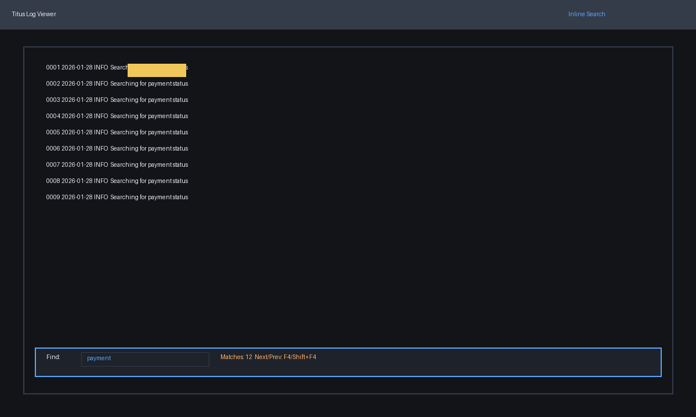
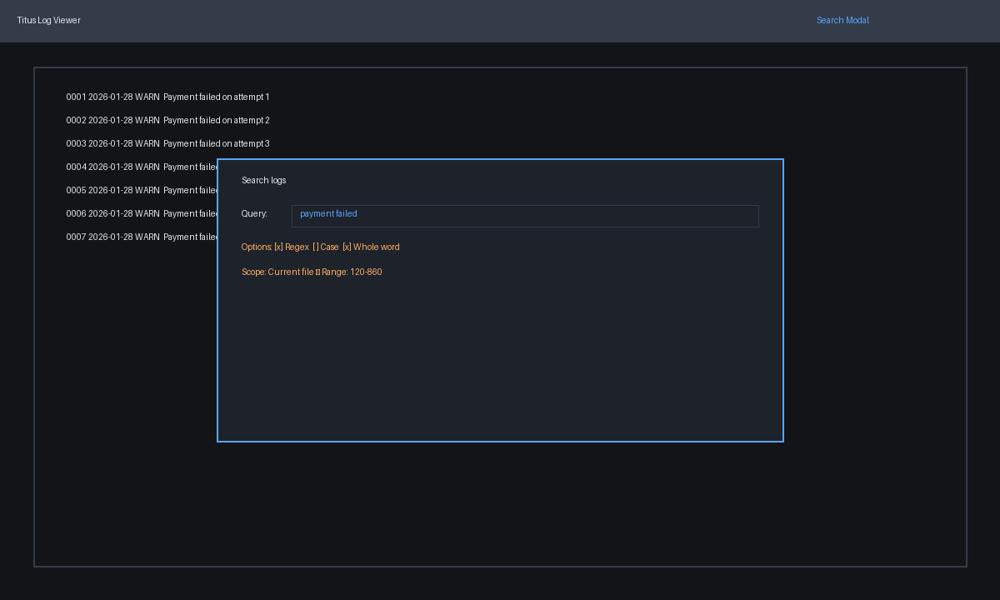
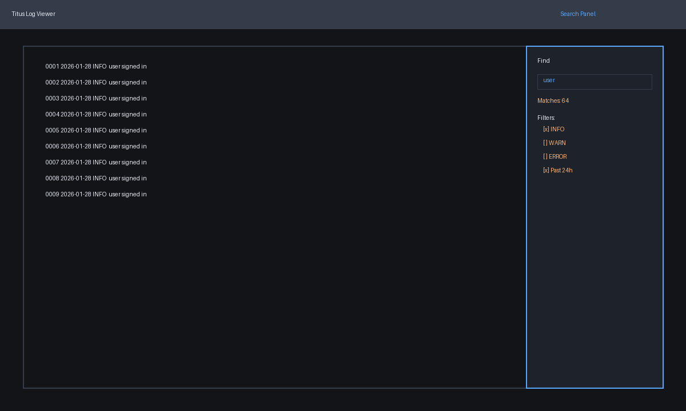
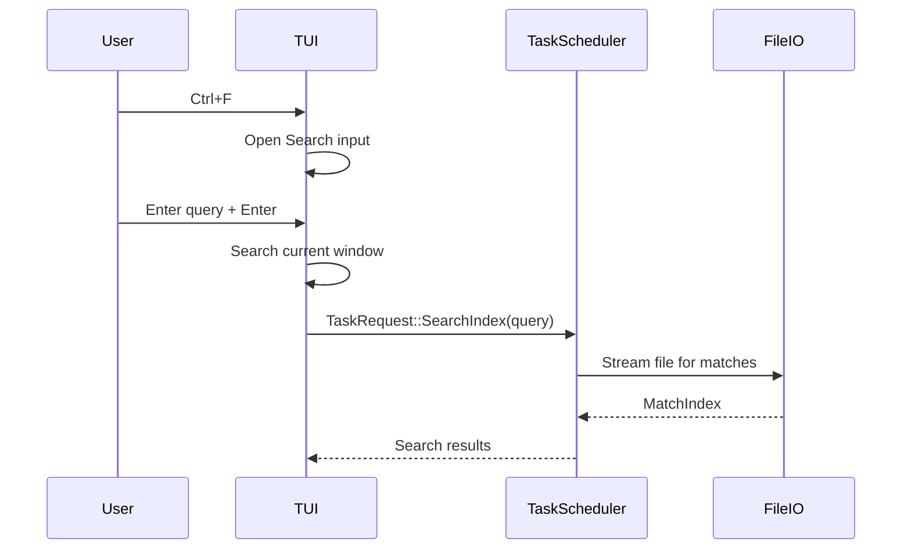

# Log search/find feature plan

## Goal
Enable fast search and navigation within log files, with configurable options (regex, case, whole word) and compatibility with partial file loading.

## Constraints & considerations
- Must scale for large files (millions of lines).
- Needs to harmonize with partial loading and multi-file support.
- Provide efficient navigation between matches.

## User stories
- As a user, I can search for a string and see matches highlighted.
- As a user, I can use regex/case/whole-word options.
- As a user, I can move to next/previous match quickly.

## Solution options
### Option A: Inline search bar


**Pros**
- Keeps focus in viewer; minimal layout changes.

**Cons**
- Limited room for advanced options.

### Option B: Modal search dialog


**Pros**
- Space for advanced options and scope configuration.

**Cons**
- Interrupts flow.

### Option C: Side panel search


**Pros**
- Persistent filters and history; aligns with multi-file UI.

**Cons**
- Uses horizontal space.

## Implementation plan (shared steps)
1. **State**
   - `SearchState { query, regex, case_sensitive, whole_word, matches, active_match }`.
   - `SearchScope` (current file, all files, range).
2. **Search engine**
   - For full files: precompute match indices on input change.
   - For partial files: compute within window + optional background indexer.
3. **Navigation**
   - `F4` / `Shift+F4` for next/prev match.
   - Center view on active match and update selection.
4. **Highlighting**
   - Use `ratatui` spans to highlight match ranges.
   - Optionally highlight all matches or only active match.
5. **Integration**
   - For multiple files: maintain search state per file or a shared query + per-file results.

## Option A implementation plan (inline)
```rust
fn update_search(query: &str, state: &mut State) {
    let matcher = build_matcher(query, state.search.regex, state.search.case_sensitive);
    state.search.matches = matcher.find_in_lines(&state.active_file.lines);
}
```

- Inline bar at bottom with minimal toggles (regex/case).

## Option B implementation plan (modal)
```rust
fn render_search_modal(frame: &mut Frame, area: Rect, state: &State) {
    let modal = centered_rect(60, 30, area);
    frame.render_widget(Clear, modal);
    frame.render_widget(Block::default().title("Search"), modal);
}
```

- Include options toggles and scope selection.
- On submit, run search and close dialog.

## Option C implementation plan (side panel)
```rust
fn render_search_panel(frame: &mut Frame, chunks: &[Rect], state: &State) {
    frame.render_widget(Block::default().title("Search"), chunks[1]);
    // render query, filters, and result count
}
```

- Keep filters visible; allow live search as user types.

## Integration with other features
- **Partial loading**: fetch additional windows when navigating matches outside current window.
- **Go-to line**: sharing highlight logic (active line). 
- **Multiple files**: search results can show per-file match counts.

## Risks & mitigation
- Regex with large files may be slow → use `regex` crate with throttled updates.
- Partial loading needs match indexing outside current window → background indexing or fallback to “search within window”.

## Open questions
- Should search be live or require explicit submit?
- Should matches be highlighted globally or only active line?
- Should the search support filtering by log level/time?

## Sequence diagram (search with partial loading)

