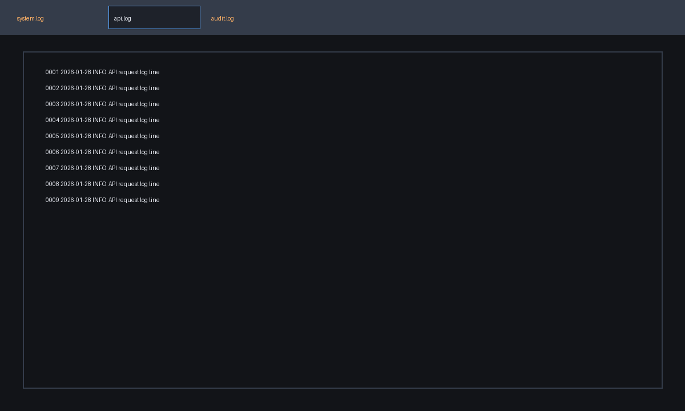
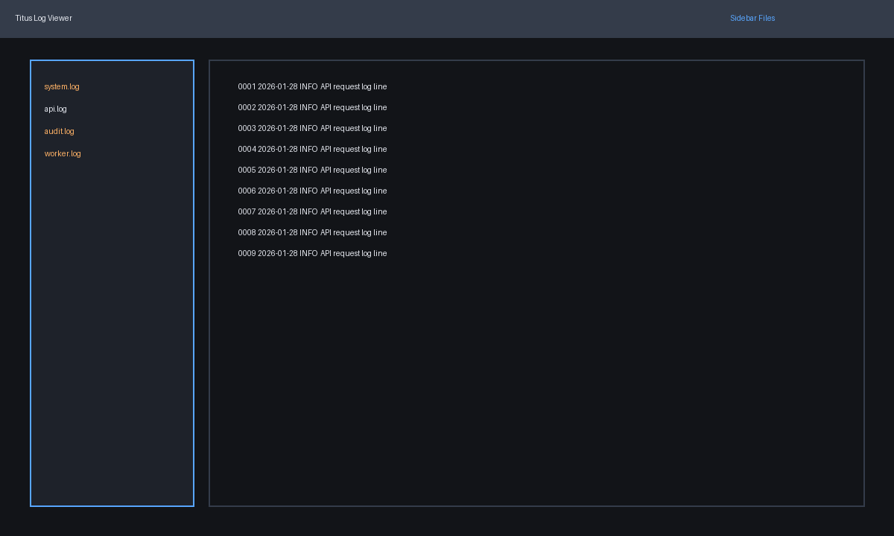
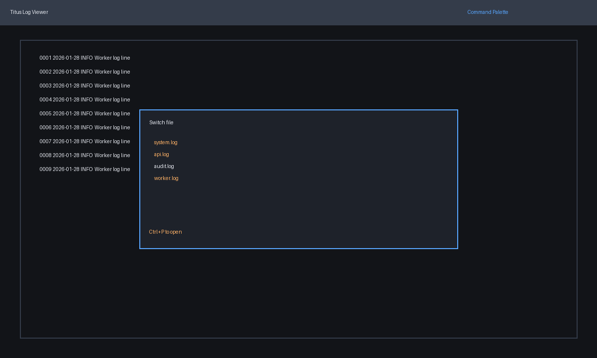
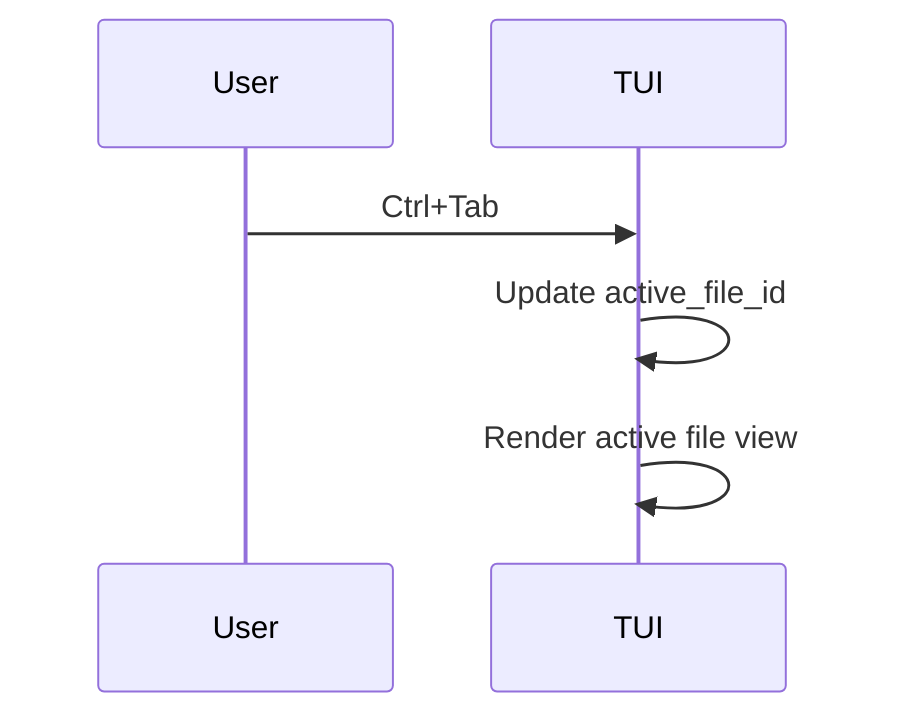

# Multiple files support plan

## Goal
Support opening and switching between multiple log files while keeping per-file search, scroll, and window state intact.

## Constraints & considerations
- Must align with file import flow and partial loading.
- Should scale to at least 5-10 open files without clutter.

## User stories
- As a user, I can open multiple files and switch between them quickly.
- As a user, each file preserves its scroll position and search state.

## Solution options
### Option A: Tab bar


**Pros**
- Familiar pattern; quick switching.

**Cons**
- Limited space for many files.

### Option B: Sidebar list


**Pros**
- Scales to many files; can show status per file.

**Cons**
- Reduces log view width.

### Option C: Command palette switcher


**Pros**
- Scales well; minimal screen usage.

**Cons**
- Requires extra keystroke; less discoverable.

## Implementation plan (shared steps)
1. **State updates**
   - Extend `State` with `open_files: Vec<LogFileState>` and `active_file_id`.
   - Each `LogFileState` stores per-file view state (scroll, window, search state).
2. **File lifecycle**
   - File import adds a new `LogFileState` entry.
   - Close file action removes entry and updates active file.
3. **UI rendering**
   - Render a top tab bar, side list, or palette based on chosen option.
4. **Keyboard shortcuts**
   - `Ctrl+Tab` next file, `Ctrl+Shift+Tab` previous.
   - `Ctrl+W` close file.

## Option A implementation plan (tabs)
```rust
fn render_tabs(frame: &mut Frame, area: Rect, state: &State) {
    let titles = state.open_files.iter().map(|f| f.file_name.clone());
    let tabs = Tabs::new(titles.collect::<Vec<_>>());
    frame.render_widget(tabs, area);
}
```

- Use `ratatui::widgets::Tabs` for display.
- Apply active tab style.

## Option B implementation plan (sidebar)
```rust
fn render_file_list(frame: &mut Frame, area: Rect, state: &State) {
    let items = state.open_files.iter().map(|f| ListItem::new(f.file_name.clone()));
    frame.render_widget(List::new(items.collect::<Vec<_>>()), area);
}
```

- Sidebar list can integrate with file import panel.

## Option C implementation plan (command palette)
```rust
fn handle_palette_select(state: &mut State, selected: usize) {
    state.active_file_id = state.open_files[selected].id;
}
```

- Palette opens with `Ctrl+P`, uses fuzzy match if needed.

## Integration with other features
- **File import**: imports add to `open_files`.
- **Search**: each file keeps its own search state and match cache.
- **Go-to line**: uses active file context.

## Risks & mitigation
- Many files open could bloat memory → partial loading per file + LRU caching.

## Open questions
- Should files be re-ordered by recent access?
- Should there be a maximum open file limit?

## Sequence diagram (switching files)

