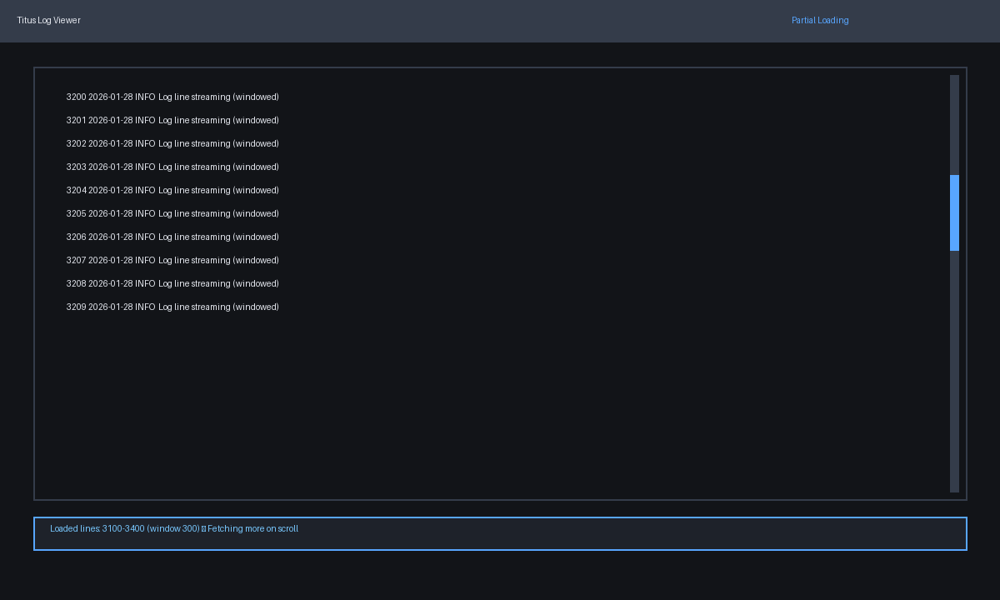
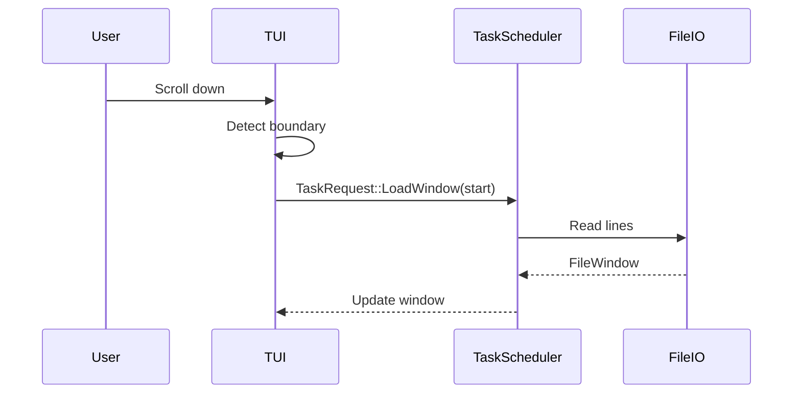

# Partial log file loading plan

## Goal
Load only a window of the log file into memory while enabling smooth scrolling, search, and go-to line behavior.

## Constraints & considerations
- Must coordinate with search results and go-to line requests.
- Should keep memory usage stable for very large files.
- Needs to support fast scrolling without blocking.

## User stories
- As a user, I can open massive log files without memory pressure.
- As a user, scrolling near the edges fetches additional data seamlessly.

## Solution options
### Option A: Windowed loading with lazy scroll fetch


**Pros**
- Simple to reason about.
- Easy to align with go-to line by shifting window.

**Cons**
- Scroll may pause when new window is fetched.

### Option B: Chunked cache with LRU
**Concept**: Maintain a cache of file chunks (e.g., 1k lines each) and load into memory on demand.

**Pros**
- Smooth scrolling if adjacent chunks cached.

**Cons**
- More complex cache management.

### Option C: Memory-mapped file view
**Concept**: Use `memmap2` to map file and slice lines on demand.

**Pros**
- Fast random access without loading entire file.

**Cons**
- Platform-specific concerns; still requires line indexing.

## Implementation plan (shared steps)
1. **Data model**
   - `FileWindow { start_line, end_line, lines: Vec<String> }`.
   - `LogFileState` stores total line count and current window.
2. **Window loading**
   - On initial load, read first N lines or tail (configurable).
   - On scroll near boundary, trigger `TaskRequest::LoadWindow(start_line)`.
3. **Indexing**
   - Build a lightweight line offset index for jump/search.
   - Store offsets to support line-based seeking.
4. **Integration**
   - Search uses current window and optional background indexer.
   - Go-to line requests window shift if target outside current window.

## Option A implementation plan
```rust
fn on_scroll(state: &mut State, delta: i32) {
    if state.viewer.at_window_edge(delta) {
        let new_start = state.viewer.calc_window_start(delta);
        state.task_scheduler.queue(TaskRequest::LoadWindow(new_start));
    }
}
```

- Keep window size configurable (e.g., 300 lines).
- Provide status bar indicator for loading.

## Option B implementation plan (LRU cache)
```rust
struct ChunkCache {
    cache: LruCache<usize, Vec<String>>, // chunk index -> lines
}
```

- Load chunks on demand, evict least recently used.
- Combine multiple chunks for rendering.

## Option C implementation plan (memory map)
```rust
let mmap = unsafe { Mmap::map(&file)? };
let slice = &mmap[start..end];
```

- Precompute line offsets in a background task.
- Provide safe fallback if memory map fails.

## Integration with other features
- **Search**: maintain per-window search results and optionally global index.
- **Go-to line**: `GoToLine` requests window shift.
- **Multiple files**: each file keeps independent window and cache.

## Risks & mitigation
- Large files may produce slow line counting → create async indexer.
- Search results may become stale → tie to window version.

## Open questions
- Should initial view be head, tail, or last accessed line?
- Should window size be user-configurable?

## Sequence diagram (windowed loading)

