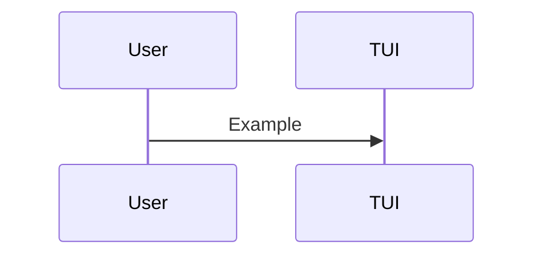

# Feature plan template

Use this template for future plans.

## Goal

## Constraints & considerations

## User stories

## Solution options

## Implementation plan (shared steps)

## Option A implementation plan

## Option B implementation plan

## Option C implementation plan

## Integration with other features

## Risks & mitigation

## Open questions

## Sequence diagram

